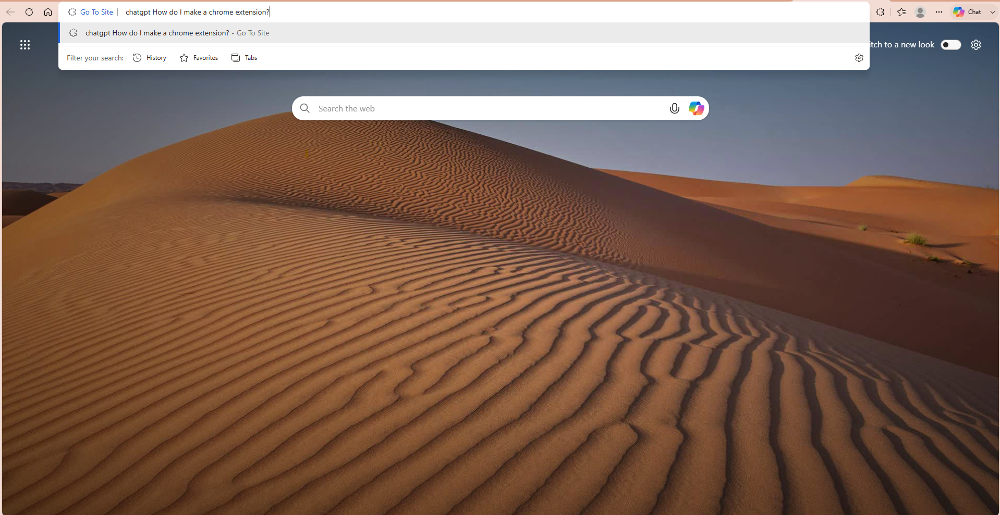
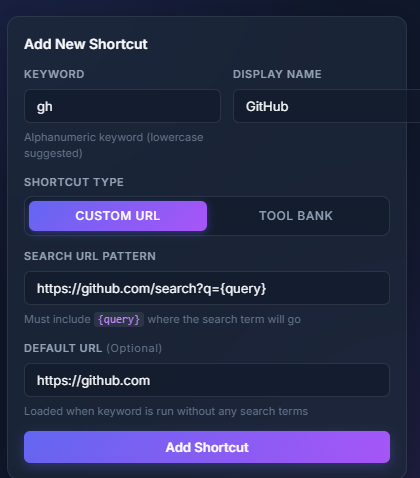

# Go To Site

> Launch websites, AI assistants, and your favorite workflows directly from your browser's search bar.

![Banner Screenshot Placeholder]

**Go** is a tiny productivity extension built around one simple idea:

> **Stop navigating. Start typing.**

Instead of opening websites, searching through bookmarks, or clicking around browser tabs, simply type a command and let Go do the rest.

Whether you're opening ChatGPT, comparing two LLMs, searching GitHub, or launching your own custom shortcuts, Go aims to remove friction from everyday browsing.

---

## Why?

Modern browsers are incredibly powerful.

Ironically, accessing our favorite websites often still looks like this:

* Open a new tab
* Type a URL
* Wait for the page
* Click the search box
* Paste or type your prompt
* Press Enter

Do that dozens of times a day and it quickly becomes muscle memory—but not necessarily efficient.

Go turns your browser into a lightweight command launcher.

Instead of navigating websites, you simply tell your browser what you want.

```text
go chatgpt explain dependency injection
```

```text
go github microsoft semantic kernel
```

```text
go yt system design interview
```

```text
go compare qwen3.5:9b vs gemini2.5-flash
```

Type once.

Press Enter.

You're there.

---

# Positioning

This is intentionally a **small productivity project**.

I'm building it because it's something I genuinely use every day, and I thought others might find it useful too.

If enough people enjoy using it, I'll continue expanding it with more workflows, integrations, and quality-of-life improvements.

If not, it'll still remain a lightweight open-source tool that makes my own browsing a little faster.

Either outcome is perfectly fine.

Feedback, ideas, and pull requests are always welcome.

---

# Features

## 🚀 AI shortcuts

Open your favorite AI assistant with a prompt directly from the address bar.

```text
go chatgpt explain quicksort
```

```text
go claude review this code
```

```text
go gemini summarize this article
```

No extra clicks.

No manually pasting prompts.

Just type and go.

---

## ⚙️ Custom shortcuts

Create your own commands for any website.

Examples:

```text
go tt cat videos
```

```text
go reddit sql server
```

```text
go maps coffee near me
```

Or build completely custom workflows for websites you use every day.

---

## 🧠 Advanced productivity tools

Go also includes higher-level commands that perform multiple actions for you.

For example:

```text
go compare qwen3.5:9b vs gemini2.5-flash
```

could automatically:

* Open both AI tools
* Open an LLM comparison page
* Arrange everything for side-by-side evaluation

Instead of manually opening three or four tabs, one command prepares the entire workspace.

More workflow commands are planned.

---

## 🎯 Designed to stay lightweight

Go doesn't try to replace your browser.

It simply adds a tiny command layer on top of it.

No accounts.

No cloud service.

No subscriptions.

Just shortcuts.

---

# Installation

Coming soon.

➡️ **Chrome Web Store**

https://your-extension-link-here

---

# Usage

Using Go is simple.

Type:

```text
go <shortcut> <query>
```

Examples:

```text
go chatgpt explain binary search trees
```

```text
go claude optimize this SQL query
```

```text
go github browser extension
```

```text
go yt postgres indexing
```

```text
go compare qwen3.5:9b vs gemini2.5-flash
```

---

# Custom Shortcuts

You can define shortcuts for virtually any website.

For example:

| Shortcut | Opens       |
| -------- | ----------- |
| `gpt`    | ChatGPT     |
| `claude` | Claude      |
| `yt`     | YouTube     |
| `gh`     | GitHub      |
| `reddit` | Reddit      |
| `maps`   | Google Maps |

You decide what each shortcut does.

---

# Examples

## Launching ChatGPT



---

## Creating a custom shortcut

> 

---

# Planned Features

This project is still young.

Some ideas I'd like to explore include:

* Clipboard placeholders
* Selection placeholder
* Multiple browser support
* Import/export shortcut collections
* Community shortcut packs
* Built-in developer workflows
* Keyboard-first configuration
* Better AI integrations
* Custom workflow scripting

Have another idea?

Open an issue!

---

# Contributing

Bug reports, feature requests, and pull requests are greatly appreciated.

Even small improvements help make the project better for everyone.

---

# Philosophy

There are already fantastic browsers.

There are already fantastic AI assistants.

Go isn't trying to replace either.

Its job is simply to make getting to them faster.

Less clicking.

Less navigating.

More doing.

---

# License

MIT

Feel free to use, modify, and contribute.